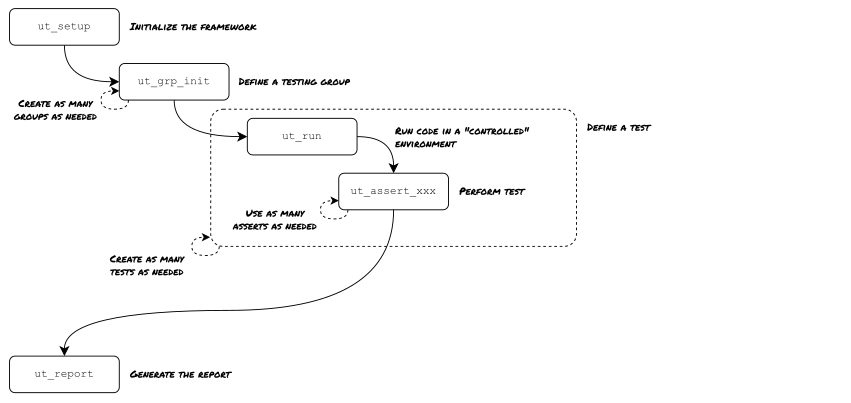
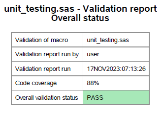

# Why SAS Unit testing?

Most companies using SAS have their own set of macro functions as part of standardizing of their processes.

However, creating and maintaining such a library is complex. In particular, ensuring the reliability of the standards during their lifetime is critical as any inconsistency can impact deliverables.

To avoid this, there is no other choice than performing validation.

That's here a unit testing framework provides several benefits:
* It's **efficient** because when using such a tool, users focus on writting tests cases that covers business requirements. Technical stuff is covered by the framework.
* It's **fast** because running a validation plan is as simple as running a SAS program and completes in seconds.
* It's **reliable** because the full validation plan is run even in case of minor updates: side effects are annihilated.
* It's **functional** because the framework generates the validation documentation.

# How does it work?

This framework is split into several components to use like bricks:


The next sections will delve deeper into the core concept of the framwork.

# Getting started

## 1 - Installation
Create a new SAS program and reference the framework.\
Either use the main repository:
```sas
filename utf url "https://raw.githubusercontent.com/sasrmnj/sas_unit_testing/main/unit_testing.sas";
%include utf;
```

Or [download](https://raw.githubusercontent.com/sasrmnj/sas_unit_testing/main/unit_testing.sas) the framework and include it:
```sas
%include "/path/to/the/unit_testing.sas";
```

## 2 - Initializing the framework
Before using the framework, you must initialize it. This is done through the `ut_setup` function:
```sas
%ut_setup;
```

Tip: this function can be used as well to reset the framework.

## 3 - Enabling code coverage
Code coverage is a feature that measures how much the source code is executed by a test suite. The frameworks implements its own code coverage module to offer more flexibility than the native SAS code coverage tool (in particular, this module allows nested macro functions).\
To perform a code coverage analysis, the module performs the following:
1) Identification of various execution branches
2) Injection of trackers at the begining of each execution branches
Then, during test suite execution, the framework identifies which trackers have been triggers to determine a percentage of code execution.

To enable to code coverage feature, invoke the `ut_cov_init` function:
```sas
%ut_cov_init(in_file=/../macro.sas);
```
| Parameter | Purpose |
|-----------|---------|
| in_file | Path of the SAS code to validate |
| out_file | Path of the SAS code amended with code coverage trackers (output value) |

To not alter the original SAS program, a copy (with the code coverage trackers) is created in a temporary directory. By default, `ut_cov_init` includes this modified file.\
If you don't want to automatically include the modified file with code coverage trackers, you must provide the name of a macro variable in `out_file`. In this case, `ut_cov_init` **does not** include the modified file, instead it returns its path.

## 4 - Creating a testing group
Once the framework has been initialized, you can create your first `testing group`. It serves as a **container** for the tests belonging to the validation of a single feature. This helps to keep things organized and clear for the reporting.

To create a `testing group`, use the `ut_grp_init` function:
```sas
%ut_grp_init(description);
```
| Parameter | Purpose |
|-----------|---------|
| description | Short text to describe the group. It is displayed in the output report |

## 5 - Creating a test.
After a testing group has been created, you can define `tests`. They are composed of 2 steps:
1) Running some code to test
2) Evaluating the execution status

### Running some code to test

Performing a test means running some code to ensure it works as expected. However, some code will probably generates issues (warning or error). To distinguish expected issues (raised by the tested code) from unexpected issues (that must be highlighted and fixed), the framework provides a `ut_run` function to keep the main SAS session safe from any issue that could be raised by the tested code:
```sas
%ut_run(
    stmt = %nrstr(
                *-- Some SAS code to run --*;
                *-- Issues raised here will not appear in the main SAS log --*;
            )
);
```
| Parameter | Purpose |
|-----------|---------|
| stmt | Some SAS code to run |
| debug | When not null, disable the SAS log redirection to report the messages in the SAS log.<br>Value is `n` by default |

### Evaluate the execution status
Once the code to be tested has been run, you can evaluate its execution status by using one ore more **assert** functions.\
These functions embed everything needed to perform a test and log the status of that test so it can be output by the reporting module:
1) Logging of the test to be performed (type of test)
2) Status of the test by comparing the expected result vs the real resutl of the test
3) Recording of test details for meaningful information in the output report

It's also easy to create your own assert functions, using this template:
```sas
%macro ut_assert_xxx(description=, ..., expected_result=PASS);
    *-- Call to ut_tst_init is a prerequisite: it initializes the test before logging the result --*;
    %ut_tst_init(type=ut_assert_xxx, description=&description., expected_result=&expected_result.);

    *-- Implement the logic of the assert here --*;
    *-- There are only 2 constraints: set the value of ut_tst_res & ut_tst_det --*;

    *-- ut_tst_res is the result of your test. It will be compared to expected_result, if values match, the test is PASS, else it is FAIL --*;
    %let ut_tst_res = PASS;

    *-- ut_tst_det provides details of the evaluation of ut_tst_res for the report. --*;
    *-- It helps to understand what has been performed so a reviewer can easilty understand why the test result is PASS or FAIL --*;
    %let ut_tst_det = Details about the evaluation of ut_tst_res;

    *-- Call to ut_log_result is mandatory: it records the test in a dataset for the reporting module --*;
    %ut_log_result;
%mend ut_assert_xxx;
```

Here is the list of available *assert* functions:
| Function name                 | Purpose |
|-------------------------------|---------|
| [ut_assert_error](#ut_assert_error)                           | Ensure an error has been raised |
| [ut_assert_noerror](#ut_assert_noerror)                       | Ensure no error has been raised |
| [ut_assert_warning](#ut_assert_warning)                       | Ensure a warning has been raised |
| [ut_assert_nowarning](#ut_assert_nowarning)                   | Ensure no warning has been raised |
| [ut_assert_noissue](#ut_assert_noissue)                       | Ensure no error/no warning has been raised |
| [ut_assert_log](#ut_assert_log)                               | Ensure a text is present in the SAS log |
| [ut_assert_file](#ut_assert_file)                             | Ensure a file exists |
| [ut_assert_macro](#ut_assert_macro)                           | Ensure some macro statement is valid |
| [ut_assert_dataset_structure](#ut_assert_dataset_structure)   | Ensure dataset variables number, names and attributes are valid |
| [ut_assert_dataset_content](#ut_assert_dataset_content)       | Ensure dataset content is valid |
| [ut_assert_dataset](#ut_assert_dataset)                       | Ensure dataset structure and content are valid |
| [ut_assert_dataset_tc](#ut_assert_dataset_tc)                 | Allow to run a series of tests provided within a dataset |

## Description of assert functions

### ut_assert_error
Ensure an error has been raised.\
The function checks `syserrortext` for a non-null value and `syscc` for a value > 4.
Note: `syserrortext` contains only the last error, thus if you search for a specific error that has been raised, but not necessarily the last one, you should use `ut_search_log` instead.
| Parameter name                | Purpose |
|-------------------------------|---------|
| description                   | Short text to explain why an error is expected |
| error_msg                     | If provided, must match the value stored in `syserrortext`, else the test is considered `FAIL`.<br>If ommitted, any error is valid |
| expected_result               | Expected result of the test, either PASS or FAIL <br>Value is `PASS` by default |

### ut_assert_noerror
Ensure no error has been raised.
| Parameter name                | Purpose |
|-------------------------------|---------|
| description                   | Short text to explain why no error is expected |
| expected_result               | Expected result of the test, either PASS or FAIL <br>Value is `PASS` by default |

### ut_assert_warning
Ensure a warning has been raised.\
The function checks `syswarningtext` for a non-null value and `syscc` for a between 1 and 4.
Note: `syswarningtext` contains only the last warning, thus if you search for a specific warning that has been raised, but not necessarily the last one, you should use `ut_search_log` instead.
| Parameter name                | Purpose |
|-------------------------------|---------|
| description                   | Short text to explain why a warningis expected |
| error_msg                     | If provided, must match the value stored in `syswarningtext`, else the test is considered `FAIL`.<br>If ommitted, any warning is valid|
| expected_result               | Expected result of the test, either PASS or FAIL <br>Value is `PASS` by default |

### ut_assert_nowarning
Ensure no warning has been raised.
| Parameter name                | Purpose |
|-------------------------------|---------|
| description                   | Short text to explain why no warning is expected |
| expected_result               | Expected result of the test, either PASS or FAIL <br>Value is `PASS` by default |

### ut_assert_noissue
Ensure no error and no warning has been raised.
| Parameter name                | Purpose |
|-------------------------------|---------|
| description                   | Short text to explain why no error/no warning is expected |
| expected_result               | Expected result of the test, either PASS or FAIL <br>Value is `PASS` by default |

### ut_assert_log
Ensure a given messsage has been output in the SAS log.\
> This assert works only in combination with `ut_run`

You can define what type of log message to search for (NOTE, WARNING, ERROR)
| Parameter name                | Purpose |
|-------------------------------|---------|
| description                   | Short text to explain why a message in the log is expected |
| log_type                      | Type of log message (ERROR, WARNING, NOTE...) to search for.<br>Can be ommitted |
| log_msg                       | Text value to search for |
| expected_result               | Expected result of the test, either PASS or FAIL <br>Value is `PASS` by default |

### ut_assert_file
Ensure a file exists.
| Parameter name                | Purpose |
|-------------------------------|---------|
| description                   | Short text to explain why a file is expected |
| filepath                      | Full path of the file to test |
| expected_result               | Expected result of the test, either PASS or FAIL <br>Value is `PASS` by default |

### ut_assert_macro
Ensure some macro statements are valid.
| Parameter name                | Purpose |
|-------------------------------|---------|
| description                   | Short text to explain why macro statements should be valid (or not) |
| stmt                          | Macro statement to evaluate |
| expected_result               | Expected result of the test, either PASS or FAIL <br>Value is `PASS` by default |

### ut_assert_dataset_structure
Ensure 2 given datasets have the same structure (number of variables, variable names,...).\
The function performs a `proc contents` to extract the metadata of the input datasets, then performs a `proc compare`.
| Parameter name                | Purpose |
|-------------------------------|---------|
| description                   | Short text to explain why ds_01 & ds_02 datasets should have the same structure |
| ds_01                         | A dataset |
| ds_02                         | Another dataset |
| expected_result               | Expected result of the test, either PASS or FAIL <br>Value is `PASS` by default |

### ut_assert_dataset_content
Ensure 2 given datasets have the same content.\
The function performs a `proc compare` but does not consider errors about metatdata mismatches (variables formats, informats, length...).\
More precisely, the `proc compare` returns a binary number `sysinfo` whose value reports the level of differences:
* bit #1 (1)      Dataset labels differ
* bit #2 (2)      Dataset types differ
* bit #3 (4)      Variable informats differ
* bit #4 (8)      Variable formats differ
* bit #5 (16)     Variable lengths differ
* bit #6 (32)     Variable labels differ
* bit #7 (64)     Base dataset has obs not in comparison dataset
* bit #8 (128)    Comparison dataset has obs not in base dataset
* bit #9 (256)    Base dataset has BY group not in comparison dataset
* bit #10 (512)   Comparison dataset has BY group not in base dataset
* bit #11 (1024)  Base dataset has variable not in comparison dataset
* bit #12 (2048)  Comparison dataset has variable not in base dataset
* bit #13 (4096)  A value comparison was unequal
* bit #14 (8192)  Conflicting variable type
* bit #15 (16384) BY variables do not match
* bit #16 (32768) Fatal error, comparison not done

| Parameter name                | Purpose |
|-------------------------------|---------|
| description                   | Short text to explain why ds_01 & ds_02 datasets should have the same content |
| ds_01                         | A dataset |
| ds_02                         | Another dataset |
| expected_result               | Expected result of the test, either PASS or FAIL <br>Value is `PASS` by default |

### ut_assert_dataset
Ensure 2 given datasets have the same structure and content.\
The function performs a `proc compare` and ensures the returned `sysinfo` value is `0`.
| Parameter name                | Purpose |
|-------------------------------|---------|
| description                   | Short text to explain why ds_01 & ds_02 datasets should be identical |
| ds_01                         | A dataset |
| ds_02                         | Another dataset |
| expected_result               | Expected result of the test, either PASS or FAIL <br>Value is `PASS` by default |

### ut_assert_dataset_tc
This function is a little bit different from others asserts.\
This function allows to provide a series of tests to perform within a dataset.\
For example, let's say you have a macro function that converts a `text` value (that should represents a date) into a `date` variable.\
Once you performed "standard" tests (e.g. ensuring mandatory parameters are provided and valid), you probably want to test various `input` values to ensure the function outputs the `expected` values.\
One strategy consists in:
1) Create a dataset with the `input` values, use the conversion function to get the `output` values
2) Create a dataset with the `input` values, and the `expected` values
3) Call `ut_assert_dataset` to ensure both datasets are identical

Another option proposed by the framework consists in providing only 1 dataset with the `input` values, the `expected` values, the `output` values and the statement to evaluate the testing.
| Parameter name                | Purpose |
|-------------------------------|---------|
| ds                            | A dataset with test cases within |
| desc_var                      | The variable name within `ds` that contains the test description |
| eval_stmt                     | The SAS statement to evaluate the result of the test |
| det_stmt                      | The SAS statement to define the value of the test details |
| exp_status_var                | The variable name within `ds` that contains the expected status of the test |

## 6 - Reporting.
The last step of the validation plan consists in outputing the reporting document.\
This is achieved with the `ut_report` function that automatically generates a PDF document that contains:
1) A summary of the validation (who/when/overall status)\
    
2) The list of tests with their status\
    
3) The list of tests with their execution details\
    
4) A code coverage report\
    

To create the report, use the `ut_report` function:
```sas
%ut_report(
    test_suite  = name of the test suite,
    report_path = /local/path
);
```
| Parameter | Purpose |
|-----------|---------|
| test_suite | Name of the test suite, this could be the name of the validated macro or SAS script |
| report_path | Path of a **directory** where report will be output. The **name** of the report is generated by the function: unit_testing_`test_suite`_`yyyymmdd`.pdf |
